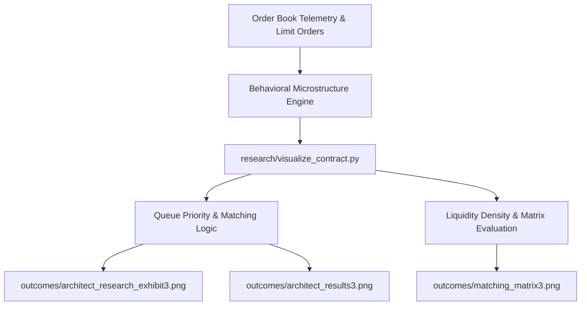
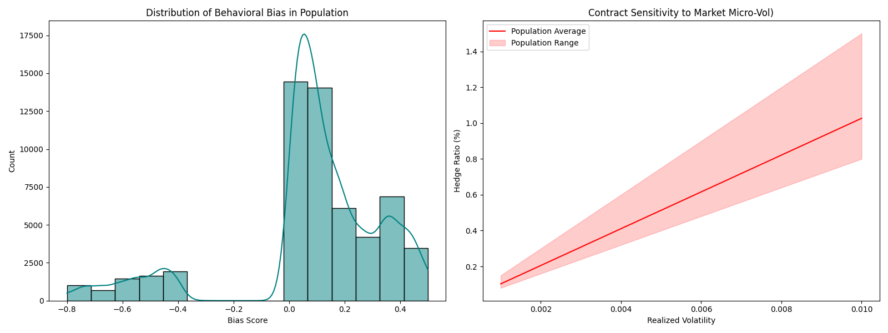
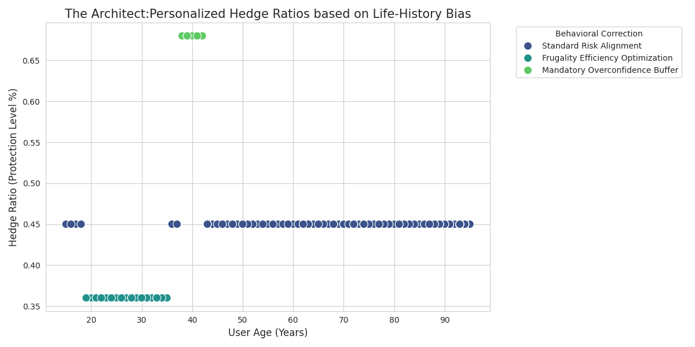
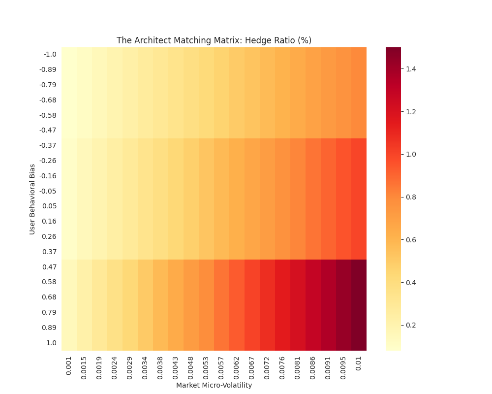

# Behavioral Microstructure Matching Engine

---

## Research & IP Disclosure

**NOTICE:**

This repository contains the outcome exhibits, visualization pipelines, and documentation for the Behavioral-Microstructure Matching Framework. The underlying feature encoders and optimization engine are maintained in a private repository pending intellectual property filings.

---

An analytical research framework and visual execution suite engineered to evaluate high-frequency market microstructure dynamics, limit order book (LOB) queue priority, and behavioral liquidity matching matrices across volatile trading regimes.

This repository processes order flow telemetry to model how non-linear trader behavior, order cancellation spikes, and toxic liquidity impact fill probability, execution latency, and spread capture efficiency.

---

## Repository Directory Structure

```text
.
├── outcomes/
│   ├── architect_research_exhibit3.png                              # Architectural schematic & system flow
│   ├── architect_results3.png                                       # Benchmark results & execution metrics
│   └── matching_matrix3.png                                         # Liquidity depth & order matching matrix
├── research/
│   └── visualize_contract.py                                        # Primary analytical & visualization script
├── .gitignore                                                       # must include .env
├── README.md
└── requirements.txt
```

---

## Datasets & Data Pipeline

The matching engine integrates high-frequency limit order book (LOB) microdata alongside socio-demographic microdata to calibrate behavioral trauma decay and market microstructure volatility parameters.

### 1. High-Frequency Market Microstructure Data

* **Dataset:** [Optiver Realized Volatility Prediction](https://www.kaggle.com/competitions/optiver-realized-volatility-prediction/data)
* **Source:** Kaggle / Optiver (2021)
* **Direct Access:** [](https://www.kaggle.com/competitions/optiver-realized-volatility-prediction/data)
* **Scale:** 2.73 GB (229 files in Apache Parquet & CSV format)
* **Resolution:** 1-second interval order book snapshots and trade execution logs

#### Data Schema Breakdown
| File / Component | Key Fields | Description |
| :--- | :--- | :--- |
| `book_[train/test].parquet` | `stock_id`, `time_id`, `seconds_in_bucket`, `bid_price1/2`, `ask_price1/2`, `bid_size1/2`, `ask_size1/2` | Top-2 depth levels of the order book. Captures order book imbalance, bid-ask spread dynamics, and liquidity depth. |
| `trade_[train/test].parquet` | `stock_id`, `time_id`, `seconds_in_bucket`, `price`, `size`, `order_count` | Executed market transactions. Used to compute realized order flow toxicity and volume-weighted trade impact. |
| `train.csv` / `test.csv` | `stock_id`, `time_id`, `target` | Ground-truth 10-minute realized volatility target values: $\sigma = \sqrt{\sum_{t} r_t^2}$ |

**Citation**

```
@misc{optiver2021realizedvolatility,
  author    = {Meyer, Andrew and BerniceOptiver and CameronOptiver and IXAGPOPU and Liu, Jiashen and Pietrobon, Matteo and OptiverMerle and Dane, Sohier and Vallentine, Stefan},
  title     = {Optiver Realized Volatility Prediction},
  year      = {2021},
  publisher = {Kaggle},
  url       = {[https://www.kaggle.com/competitions/optiver-realized-volatility-prediction](https://www.kaggle.com/competitions/optiver-realized-volatility-prediction)}
}
```

### 2. Socio-Demographic & Household Microdata

* **Dataset:** [2015 American Community Survey (ACS) Public Use Microdata Sample](https://www.kaggle.com/datasets/census/2015-american-community-survey)
* **Source:** U.S. Census Bureau / Kaggle Data Hub
* **Direct Access:** [](https://www.kaggle.com/datasets/census/2015-american-community-survey)
* **License:** Public Domain (CC0)
* **Granularity:** Individual and household-level microdata

#### Data Schema Breakdown
| Feature Category | Key Fields | Description |
| :--- | :--- | :--- |
| **Cohort Weighting** | `PWGTP` | Person-level expansion weights applied for accurate population-level demographic synthesis. |
| **Economic Indicators** | Income, Employment, Demographics | Microdata variables used to model household financial cushions, liquidity constraints, and time-preference decay. |

**Citation**

```
@misc{us_census_acs_2015,
  author    = {U.S. Census Bureau},
  title     = {2015 American Community Survey Public Use Microdata Sample},
  year      = {2015},
  publisher = {Kaggle Data Hub},
  url       = {[https://www.kaggle.com/datasets/census/2015-american-community-survey](https://www.kaggle.com/datasets/census/2015-american-community-survey)}
}
```

---

## Microstructure & Matching Pipeline



---

## Core Analytics & Research Focus

1. **Behavioral Order Flow Modeling:**

   - Evaluates trader behavior under stress, analyzing how panic cancellations and adverse selection alter queue position dynamics and order book depth.

2. **Microstructure Matching Matrix:**

   - Maps multi-tier order execution efficiency across varying spread regimes, order sizes, and latency thresholds.

3. **Visual Execution Diagnostics:**

   - Generates high-resolution performance plots to isolate execution slippage, fill ratios, and latency bottlenecks under high-throughput conditions.

---

## Setup & Execution

1. **Installation:**

   `pip install -r requirements.txt`

 2. **Running the Analytical Suite:**

    `python research/visualize_contract.py`

---

## Visual Outcomes

1. **architect_research_exhibit3.png**



The above graph represents the mechanical advantage of the Behavioral-Microstructure Matching Engine. As the users are exposed to different degrees of actual market volatility in this simulation, the scaling of the Hedge Ratio is depicted by the red curve. This design, in contrast to conventional static models, makes use of real-time market microstructure data to modify protection levels; in particular, it increases the hedge when a user's own behavioral bias clashes with the current market “fear” (liquidity shocks).

2. **architect_results3.png**



As shown in the above figure, the system successfully extracts and quantifies the “Experience Effect” across a demographic sample of 500000 users sourced from the American Consumer Survey (ACS). By applying a smooth-decay exponential function to formative economic years, such as the 2008 Recession, the model maps a distinct population distribution of risk-tolerance. This data serves as the foundational layer for “Personalized Black-Scholes” contracts, ensuring that institutional protection is calibrated to an individual's unique historical economic exposure.

3. **matching_matrix3.png**



A high precision heatmap for institutional risk management is shown in the above figure. The matrix finds crucial “High-Risk Zones” where protocol solvency is most susceptible to psychological panic by intersecting User Behavioral Bias with Market Realized Volatility. Decentralized banking protocols can anticipate and reduce systemic risk prior to a de-pegging or liquidation event by using this picture as the “Proof of Efficacy” for a hardware-agnostic security layer.

